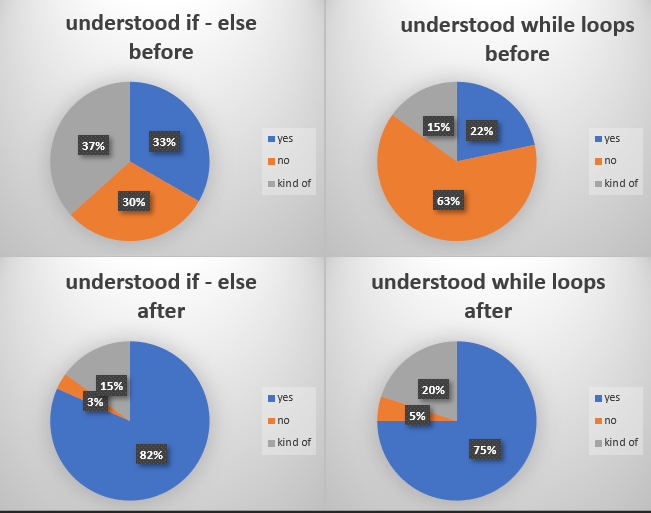
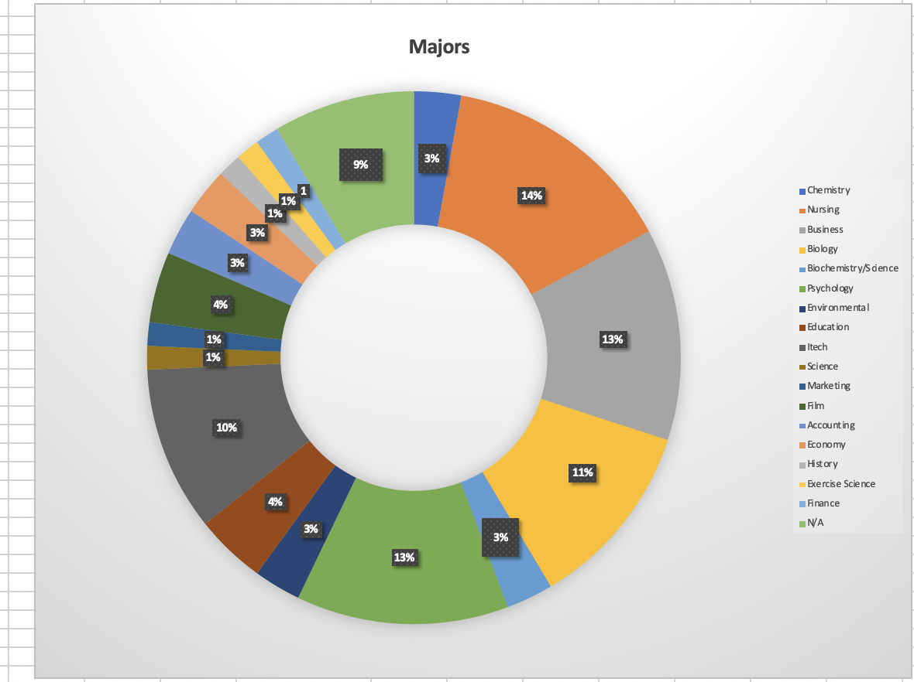
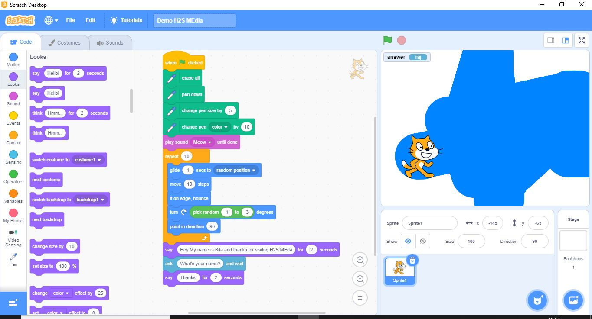

# Using Visual, Block-Based, Event-Driven Language to Teach Coding Skills

## Project Description

MaKey MaKey Pool is a fun pool game that teaches students coding skills using “if-statements”, “while loops” and building blocks with the Scratch programming language. The MaKey MaKey circuit board will be used in place of the computer mouse/keyboard mousepad. The project was created by Makey Your Shot, a group of students a part of the Technology Ambassadors Program at Georgia Gwinnett College. The [Technology Ambassadors Program](https://www.ggc.edu/academics/schools/school-of-science-and-technology/research-internships-service-learning/technology-ambassador-program/) is a program that offers students opportunities to learn more about technology, and helps them develop creativity, leadership, communication, and teamwork skills, while also giving them the oppurtunity to do community outreach. The target for this project were people of all ages that were unfamiliar with technology. Here are the results that were gathered from the 72 participants during the class workshops that were held:

### Results

**Results of the Class Workshop**

**Gauging the Difficulty of the Class Workshop**

**Majors of the Participants**

### Videos of Each Level

1. [Level 1](Videos/Level_1.mkv)
2. [Level 2](Videos/Level_2.mkv)
3. [Level 3](Videos/Level_3.mkv)

## The Team

- **Samuel Groom**: Software Development Major :pizza:
- **Asho Issak**: Software Development Major :woman_with_headscarf:
- **Johnson Ngao**: Software Development Major :grin:
- **Taylor Williams**: Software Development Major :woman_technologist:
- **Dr. Anca Doloc-Mihu**: Assistant Professor of Information Technology :woman_teacher:
- **Dr. Cindy Robertson**: Assistant Professor of Information Technology :woman_teacher:

## Outreach Activities

1. **TAP Expo, Apr 28, GGC** – To promote IT field and the TAP program to college students
2. **Class Workshops** – on Apr 9 and Apr 13 (2 occasions), to promote IT field to non-IT college students

## Technologies

1. **Scratch Programming Language**: [Scratch](https://scratch.mit.edu/) is a project of the Lifelong Kindergarten Group at the MIT Media Lab. It was created in 2002, and is an interactive programming language that allows users to create interactive stories, games, and animations.

2. **MaKey MaKey**: The [MaKey MaKey](https://makeymakey.com/) is an electronic invention kit for all ages! The Makey Makey allows you to take everyday objects and combine them with the internet. Using the alligator clips attached to any conductive material you can control the keyboard of your computer, such as the space bar, arrow keys and left click of the mouse.

## Installation

### Scratch

1. [Sign up](https://scratch.mit.edu/join) to save your project files.
2. Import any of these files to play the level or make changes to it!
	* [Level 1](Game_Files/TAP_Pool_Level_1.sb3)
	* [Level 2](Game_Files/TAP_Pool_Level_2.sb3)
 	* [Level 3](Game_Files/TAP_Pool_Level_3.sb3)
  

### MaKey MaKey

1. **Plug in the USB** The small side of USB cable plugs into MaKey MaKey, and the big side plugs into computer.
2. **Close Pop Up Windows** Your computer may ask you to install drivers or do other setup. You can click cancel or close the window.
3. **Connect to EARTH** Connect one end of an alligator clip to "Earth" on the bottom of the front side of MaKey MaKey. Hold the metal part of the other end of the alligator clip between your fingers. You are now "grounded." 
4. **Connect to "Space" and Try It** While you're still grounded, touch the round "Space" pad on the Makey Makey. You should see a green light on the Makey Makey, and your computer will think the space bar was pressed.
5. **Connect to Ports A1-A5** Use one end of your 5 connector wires and connect them into ports A1, A2, A3, A4, and A5 on the back of the MaKey MaKey circuit board. Connect the other ends to your makeshift keys (see Usage below).
6. **Try It!** You should be able to use your makeshift keys as a substitute for the mouse/keyboard pad. 

## Usage

### Scratch

| Color of Blocks         | Category      | Usage  |
|:-------------:|:-------------:|:-----:|
|  | Motion | Moves sprites, changes angles and position |
|  | Looks | Controls the visuals of the sprite |
|  | Sound | Plays audio files and effects |
|  | Events | Event handlers |
|  | Control | Conditionals and loops etc. |
|  | Sensing | Sprites can interact with the surroundings |
|  | Operators | Mathematical operators, comparisons |
|  | Variables | Variable and List usage and assignment |
|  | My Blocks | Custom procedures |

**Tutorials**: Click [here](https://scratch.mit.edu/ideas) to watch tutorials of the many ways you can create a Scratch project.

**uu**

### MaKey MaKey

**Try Out Everyday Stuff!** Make anything into a key! You can make a connection through anything that's even a little bit conductive. You can also create inventions that combine conductive and non-conductive parts. Here are a few things to try:
- Most fruits and vegetables work great.
- Lots of other foods work too. We've tried marshmallows, gummy candies, macaroni and cheese, cupcakes, shrimp, and lots of other things.
- Plants can work too. Try some leaves or flowers, but nothing too dry.
- Play-Doh, Model Magic and other clays work very well as long as they stay moist.
- People are conductive! Connect one person to ground, and another to an input, and you can trigger sounds when they high-five.
- Graphite from a pencil can work. Make thick, dark lines, and be sure to draw on a smooth surface.
- Foil and other metal objects will work. Try out coins, magnets, nuts and bolts, forks and knives, or pots and pans.
