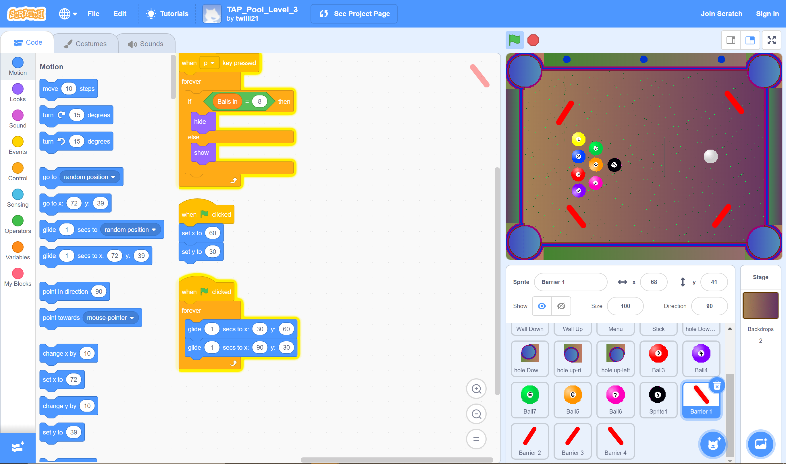

# Using Visual, Block-Based, Event-Driven Language to Teach Coding Skills

## Project Description

MaKey MaKey Pool is a fun pool game that teaches students basic coding skills using “if-statements”, “while loops” and building blocks with the Scratch programming language. The MaKey MaKey circuit board will be used in place of the computer mouse/keyboard mousepad. The project was created by Makey Your Shot, a group of students a part of the Technology Ambassadors Program at Georgia Gwinnett College. The [Technology Ambassadors Program](https://www.ggc.edu/academics/schools/school-of-science-and-technology/research-internships-service-learning/technology-ambassador-program/) is a program that offers students opportunities to learn more about technology, and helps them develop creativity, leadership, communication, and teamwork skills, while also giving them the oppurtunity to do community outreach. This project was created with the goal of attracting non-technical people to like and get excited about technology. The students that participate in the outreach events will be able to learn these basic coding skills through demonstrations and hands-on activities (making their own changes to the game).

### Videos of Each Level

1. [Level 1](Videos/Level_1.mkv)
2. [Level 2](Videos/Level_2.mkv)
3. [Level 3](Videos/Level_3.mkv)

## The Team

- **Samuel Groom**: Software Development Major :pizza:
- **Asho Issak**: Software Development Major :woman_with_headscarf:
- **Johnson Ngao**: Software Development Major :grin:
- **Taylor Williams**: Software Development Major :woman_technologist:

## The Advisors

- **Dr. Anca Doloc-Mihu**: Assistant Professor of Information Technology :woman_teacher:
- **Dr. Cindy Robertson**: Assistant Professor of Information Technology :woman_teacher:

## Outreach Activities

1. **TAP Expo, Apr 28, GGC** – To promote IT field and the TAP program to college students
2. **Class Workshops** – on Apr 9 and Apr 13 (2 occasions), to promote IT field to non-IT college students

### Class Workshop Results

72 students participated in the 2 class workshops. 90% of them were non-IT majors, while 10% were IT majors. Their ages ranged from 18 to 58 years old. Based on the pre-survey results, 30% understood the concept of if-statements, 37% kind of understood the concept of if-statements, and 33% did not understand the concept of if-statements. In regards to while loops, 22% understood this concept, 15% kind of understood this concept, and 63% did not understand this concept. After going through the workshop and taking the post-survey, 82% finally understood the concept of if-statements, 15% kind of understood the concept of if-statements, and 3% still did not understand the concept of if-statements. In regards to while loops, 75% finally understood this concept, 20% kind of understood this concept, and 5% still did not understand this concept. 8 students actually made changes to the game, and 75% were able to understand by making complex changes, while 25% partially understood by making simple changes.

**Example of Scratch Code**

#### Game Levels

**Level 1: Standard Pool Game**

**Level 2: Added Barriers**

**Level 3: Added Moving Barriers**

## Technologies

1. **Scratch Programming Language**: [Scratch](https://scratch.mit.edu/) is a project of the Lifelong Kindergarten Group at the MIT Media Lab. It was created in 2002, and is an interactive programming language that allows users to create interactive stories, games, and animations.

2. **MaKey MaKey**: The [MaKey MaKey](https://makeymakey.com/) is an electronic invention kit for all ages! The Makey Makey allows you to take everyday objects and combine them with the internet. Using the alligator clips attached to any conductive material you can control the keyboard of your computer, such as the space bar, arrow keys and left click of the mouse.

## Installation

### Scratch
#### Creating a New Project
1. [Sign up](https://scratch.mit.edu/join) to save your project files.
2. Click **Create** to create a new project

#### Playing or Editing This Project
1. [Sign up](https://scratch.mit.edu/join) to save your project files.
2. Download any of these files to play the level or make changes to it!
	* [Level 1](Game_Files/TAP_Pool_Level_1.sb3)
	* [Level 2](Game_Files/TAP_Pool_Level_2.sb3)
 	* [Level 3](Game_Files/TAP_Pool_Level_3.sb3)
3. Click **File** and then **Load from your computer** to import the files into your account
4. Click the green flag, read the instructions, and then press **P** to play!
  

### MaKey MaKey

1. **Plug in the USB** The small side of USB cable plugs into MaKey MaKey, and the big side plugs into computer.
2. **Close Pop Up Windows** Your computer may ask you to install drivers or do other setup. You can click cancel or close the window.
3. **Connect to EARTH** Connect one end of an alligator clip to "Earth" on the bottom of the front side of MaKey MaKey. Hold the metal part of the other end of the alligator clip between your fingers. You are now "grounded." 
4. **Connect to "Space" and Try It** While you're still grounded, touch the round "Space" pad on the Makey Makey. You should see a green light on the Makey Makey, and your computer will think the space bar was pressed.
5. **Connect to Ports A1-A5** Use one end of your 5 connector wires and connect them into ports A1, A2, A3, A4, and A5 on the back of the MaKey MaKey circuit board. Connect the other ends to your makeshift keys (any household object)
6. **Try It!** You should be able to use your makeshift keys as a substitute for the mouse/keyboard pad. 

## Usage

### Scratch

**Tutorials**: Click [here](https://scratch.mit.edu/ideas) to watch tutorials of the many ways you can create a Scratch project.
