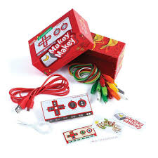

# Using Scratch to Teach Event-Driven Coding Skills
## About
MaKey MaKey Pool is a fun pool game that uses Scratch programming to teach students basic coding skills such as “if-statements” and “while loops”. The MaKey MaKey circuit board will be used in place of the computer mouse/keyboard mousepad. The project was created by Makey Your Shot, a group of students a part of the Technology Ambassadors Program at Georgia Gwinnett College. The [Technology Ambassadors Program](https://www.ggc.edu/academics/school-of-science-and-technology/research-internships-service-learning/technology-ambassador-program) is a program that offers students opportunities to learn more about technology, and helps them develop creativity, leadership, communication, and teamwork skills, while also giving them the oppurtunity to do community outreach. This project was created with the goal of attracting non-technical people to like and get excited about technology. The students that participate in the outreach events will be able to learn these basic coding skills through demonstrations and hands-on activities (making their own changes to the game).

## Project Description
* Difficulty Level: Medium
* Target Audience: 6th Grade - College
* Duration of workshop: 60-90 minutes
* Needed Materials: MakeyMakey circuit boards, objects to use as input devices for the MakeyMakey
* The project is used to educate others about "if-statements", "while-loops", and block coding by creating a fun pool game using Scratch. 
* MakeyMakey is a circuit board that can use any object as an input device.
* The primary goal of this project is to educate and create interest in the IT field for non STEM majors. 
By engaging in our workshops, students will create a pool game using block coding and using a MakeyMakey as a controller to learn about fundamental coding principles such as "if-statements" and "while-loops".
* The Technology Ambassador Program ([TAP](https://www.ggc.edu/academics/school-of-science-and-technology/research-internships-service-learning/technology-ambassador-program)) at GGC strives to break the misconceptions of the IT field by providing fun workshops for students of all backgrounds. TAP students design engaging and fun outreach workshops to encourage interest in IT and STEM.

### Videos of Each Level

1. [Level 1](archive/videos/Level_1.mkv)
2. [Level 2](archive/videos/Level_2.mkv)
3. [Level 3](archive/videos/Level_3.mkv)

## The Team
- Samuel Groom
- Asho Issak
- Johnson Ngao
- Taylor Williams

### The Advisors
- Dr. Anca Doloc-Mihu
- Dr. Cindy Robertson

## Outreach Activities
1. TAP Expo, April 28, GGC – To promote IT field and the TAP program to college students
2. Class Workshops, April 9 and April 13 (2 workshops each day) -  to promote IT field to non-IT college students

## Similar Projects
* [Monster Makey (Scratch with MakeyMakey and Audcity)](https://github.com/TAP-GGC/MonsterMakey)
* [Scratchathon (Scratch)](https://github.com/TAP-GGC/scratchathon)
* [Leap for Mankind (Scratch)](https://github.com/TAP-GGC/leapformankind)
* [NinjaTurtler (Scratch with Makey-Makey)](https://github.com/TAP-GGC/NinjaTurtles)
* [Planimals (Scratch)](https://github.com/TAP-GGC/planimals)
* [LightUp (Scratch)](https://github.com/TAP-GGC/LightUp-Teaching-Programming-Basics-with-Scratch)

## Similar Projects
### Makey Makey Projects
* [Monster Makey](https://github.com/TAP-GGC/MonsterMakey)
### Scratch Projects
* [Scratchathon](https://github.com/TAP-GGC/scratchathon)
* [Leap for Mankind](https://github.com/TAP-GGC/leapformankind)

## Technologies

|  |  |
| :-----------------------------------------------------------: | :-----------------------------------------------------------------------------------------------------------------: |
| [Scratch](https://scratch.mit.edu/) | [MakeyMakey](https://makeymakey.com/products/makey-makey-kit) |

## Installation

### Scratch
#### Creating a New Project
1. [Sign up](https://scratch.mit.edu/join) to save your project files.
2. Click **Create** to create a new project

#### Playing or Editing This Project
1. [Sign up](https://scratch.mit.edu/join) to save your project files.
2. Download any of these files to play the level or make changes to it!
	* [Level 1](Game_Files/TAP_Pool_Level_1.sb3)
	* [Level 2](Game_Files/TAP_Pool_Level_2.sb3)
 	* [Level 3](Game_Files/TAP_Pool_Level_3.sb3)
3. Click **File** and then **Load from your computer** to import the files into your account
4. Click the green flag, read the instructions, and then press **P** to play!
  

## Usage

### Scratch

**Tutorials**: Click [here](https://scratch.mit.edu/ideas) to watch tutorials of the many ways you can create a Scratch project.
